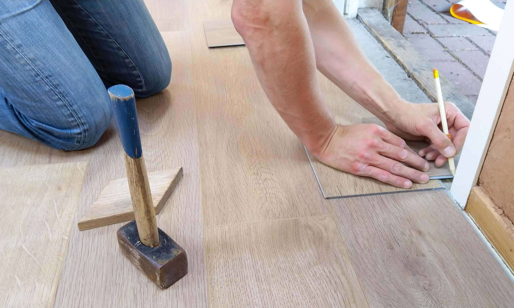

# JSCarousel

Creates a customisable carousel.

## Dependency

This project contains an instance of [FocusabElement](https://github.com/CodoPixel/FocusableElement);

## Get started

The project is written in TypeScript & JavaScript. Get the source code in the `src` folder and add it to your project :

```html
<script src="src/JSCarousel.js"></script>
```

There is also a CSS file :

```html
<link rel="stylesheet" href="src/style-carousel.css">
```

Now, in order to create a carousel, you need to respect an HTML structure:

```html
<section id="my-carousel" class="carousel">
    <button type="button" class="carousel-prev"> &lt; </button>
    <div class="carousel-windows">
        <div class="carousel-content" role="tabpanel" id="slider-1" aria-hidden="false">
            
            <h3>Panel 1</h3>
            <a href="#">A link</a>
        </div>
        <div class="carousel-content" role="tabpanel" id="slider-2" aria-hidden="true">
            
            <h3>Panel 2</h3>
            <a href="#" tabindex="-1">A disabled link</a>
        </div>
        <div class="carousel-content" role="tabpanel" id="slider-3" aria-hidden="true">
            
            <h3>Panel 3</h3>
            <a href="#" tabindex="-1">A disabled link</a>
        </div>
    </div>
    <button type="button" class="carousel-next"> &gt; </button>
    <ul class="carousel-tablist" role="tablist">
        <li role="tab" tabindex="0" aria-selected="true" aria-controls="slider-1"><div class="pos pos-active"></div></li>
        <li role="tab" tabindex="-1" aria-selected="false" aria-controls="slider-2"><div class="pos"></div></li>
        <li role="tab" tabindex="-1" aria-selected="false" aria-controls="slider-3"><div class="pos"></div></li>
    </ul>
</section>
```

This carousel respects the digital accessibility recommendations. Therefore, this HTML structure is very important for the Carousel to work properly. See: [Aria](https://www.accede-web.com/en/guidelines/rich-interface-components/carousels/).

## JavaScript

Create an instance of `JSCarousel`:

```javascript
const container = document.querySelector("#my-carousel");
const carousel = new JSCarousel(container, {
    autonav: true, // the carousel plays itself
    tabs: true, // the tablist
    navigations_buttons: true, // button "next" & "previous"
    autonav_delay: 5000, // the delay between each panel with autonav on
    disable_keyboard_navigation: false // the keyboard navigation is enabled by default
});
```

You can use a few functions:

```javascript
carousel.next();
```

```javascript
carousel.previous();
```

```javascript
carousel.activate_panel(2); // the index of the panel to activate.
```

```javascript
carousel.stop();
```

```javascript
carousel.play();
```

All the other functions are not meant to be used by the user.

## Example

You can see by yourself an example in the `src` folder.

## License

MIT License